# SDK 聚合系统 — 整体功能架构图

> 系统整体架构 + 13 个功能模块的详细功能架构图。所有图均用 Mermaid 语法绘制，附 PNG 截图。

## 目录

- [0. 系统整体架构](#0-系统整体架构)
- [1. 登录注册](#1-登录注册)
- [2. 数据看板](#2-数据看板)
- [3. 应用管理](#3-应用管理)
- [4. 广告位管理](#4-广告位管理)
- [5. 流量分组](#5-流量分组)
- [6. 广告源管理](#6-广告源管理)
- [7. 瀑布流配置](#7-瀑布流配置)
- [8. 数据报表](#8-数据报表)
- [9. 对账管理](#9-对账管理)
- [10. 广告平台 / Adapter](#10-广告平台--adapter)
- [11. 消息中心](#11-消息中心)
- [12. 个人中心](#12-个人中心)
- [13. 超级管理员](#13-超级管理员)

---

> 💡 **所有图均使用 Mermaid 语法绘制，附 PNG 截图（分辨率 2x 高清）**  
> 📂 PNG 文件位置：`/workspace/projects/public/architecture/`  
> 📂 副本位置：`/workspace/projects/docs/architecture/`

## 📊 图集预览

| # | 章节 | 主题 | 文件名 |
|---|------|------|--------|
| 1 | 0. 系统整体架构 | 五层架构总览（客户端/接入/应用/集成/数据） | `01_0__系统整体架构.png` |
| 2 | 1. 登录注册 | 鉴权流程 + 4 位图形码 + 双轨 Cookie/Bearer | `02_1__登录注册.png` |
| 3 | 2. 数据看板 | 4 KPI + 折线 + TOP 10 聚合 | `03_2__数据看板.png` |
| 4 | 3. 应用管理 | 19 字段 + 平台绑定 + 图标上传 | `04_3__应用管理.png` |
| 5 | 4. 广告位管理 | 5 种广告形式 × 专属字段联动 | `05_4__广告位管理.png` |
| 6 | 5. 流量分组 | 可视化规则编辑器 + 优先级 + 测试匹配 | `06_5__流量分组.png` |
| 7 | 6. 广告源管理 | 普通 + 自定义双路径 + 流量分组关联 | `07_6__广告源管理.png` |
| 8 | 7. 瀑布流配置 | Bidding/瀑布/兜底 3 层 + 双写策略 | `08_7__瀑布流配置.png` |
| 9 | 8. 数据报表 | 综合/漏斗/行为 3 子模块 + 8 维度联动 | `09_8__数据报表.png` |
| 10 | 9. 对账管理 | SDK vs API 双轨对比 + CSV 导入 | `10_9__对账管理.png` |
| 11 | 10. 广告平台 / Adapter | 6 步对接流程 + 4 Tab + 12 adapter_class | `11_10__广告平台___Adapter.png` |
| 12 | 11. 消息中心 | 3 type 触发 + 通知偏好矩阵 | `12_11__消息中心.png` |
| 13 | 12. 个人中心 | 4 操作抽屉 + API Token 管理 | `13_12__个人中心.png` |
| 14 | 13. 超级管理员 | 开发者管理 + 指标字典公式编辑器 | `14_13__超级管理员.png` |
| 15 | 附录：模块依赖关系 | 上下游依赖图 | `15_模块依赖关系图.png` |

---

## 0. 系统整体架构

> 五层架构：客户端 → 接入层 → 应用层 → 集成层 → 数据层

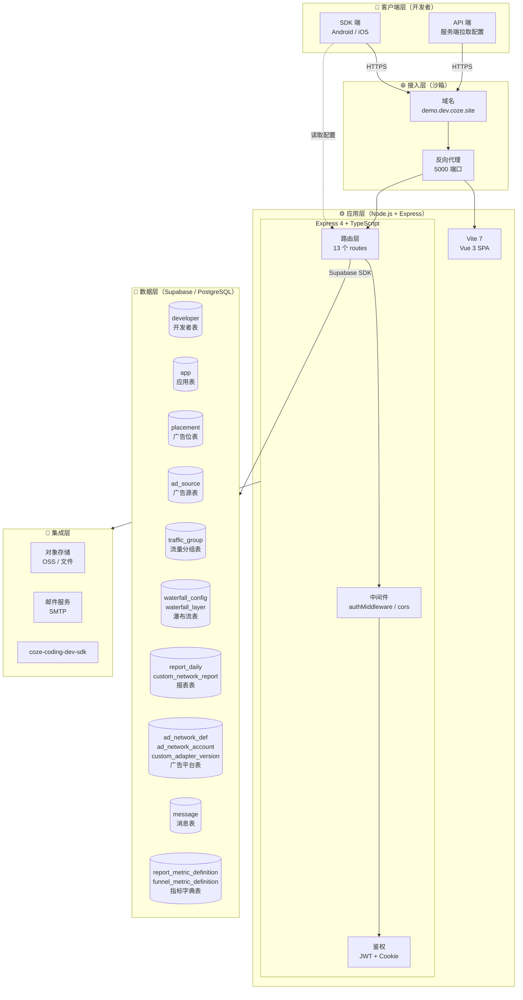
```mermaid
flowchart TB
    subgraph CLIENT["📱 客户端层（开发者）"]
        SDK[SDK 端<br/>Android / iOS]
        API_CLIENT[API 端<br/>服务端拉取配置]
    end

    subgraph CDN["🌐 接入层（沙箱）"]
        DOMAIN[域名<br/>demo.dev.coze.site]
        NGINX[反向代理<br/>5000 端口]
    end

    subgraph APP["⚙️ 应用层（Node.js + Express）"]
        VITE[Vite 7<br/>Vue 3 SPA]
        subgraph BACK["Express 4 + TypeScript"]
            ROUTER[路由层<br/>13 个 routes]
            MIDDLEWARE[中间件<br/>authMiddleware / cors]
            SUBGRAPH_AUTH[鉴权<br/>JWT + Cookie]
        end
    end

    subgraph INTEGRATION["🔌 集成层"]
        OSS[对象存储<br/>OSS / 文件]
        SMTP[邮件服务<br/>SMTP]
        COZE_SDK[coze-coding-dev-sdk]
    end

    subgraph DATA["💾 数据层（Supabase / PostgreSQL）"]
        T_DEVELOPER[(developer<br/>开发者表)]
        T_APP[(app<br/>应用表)]
        T_PLACEMENT[(placement<br/>广告位表)]
        T_AD_SOURCE[(ad_source<br/>广告源表)]
        T_TRAFFIC[(traffic_group<br/>流量分组表)]
        T_WATERFALL[(waterfall_config<br/>waterfall_layer<br/>瀑布流表)]
        T_REPORT[(report_daily<br/>custom_network_report<br/>报表表)]
        T_NETWORK[(ad_network_def<br/>ad_network_account<br/>custom_adapter_version<br/>广告平台表)]
        T_MESSAGE[(message<br/>消息表)]
        T_ADMIN[(report_metric_definition<br/>funnel_metric_definition<br/>指标字典表)]
    end

    SDK -->|HTTPS| DOMAIN
    API_CLIENT -->|HTTPS| DOMAIN
    DOMAIN --> NGINX
    NGINX --> VITE
    NGINX --> ROUTER
    ROUTER --> MIDDLEWARE
    MIDDLEWARE --> SUBGRAPH_AUTH
    ROUTER -->|Supabase SDK| DATA
    BACK -->|OSS / SMTP / 拉取| INTEGRATION
    SDK -.读取配置.-> ROUTER
```

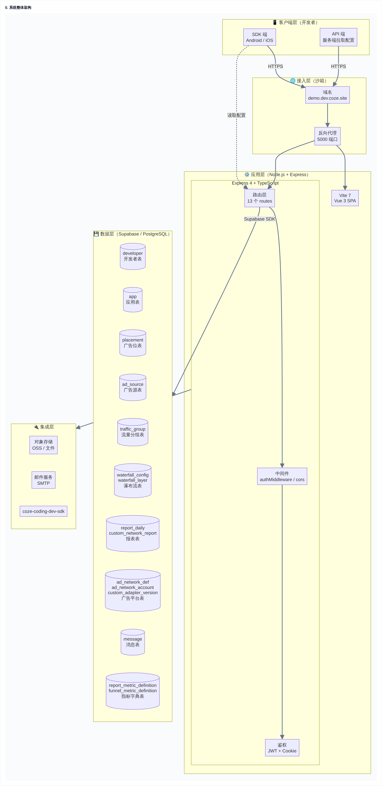

**架构特点**：

| 维度 | 说明 |
|------|------|
| **部署** | 单端口 5000（Vite dev middleware + Express） |
| **数据** | Supabase（service_role 直连，RLS 未启用） |
| **鉴权** | HttpOnly Cookie + Bearer Token 双轨 |
| **客户端** | SDK（端上集成）+ API（服务端集成） |
| **集成** | OSS（图标 / Adapter ZIP）/ SMTP（通知）/ coze-sdk（拉取第三方） |

---

## 1. 登录注册

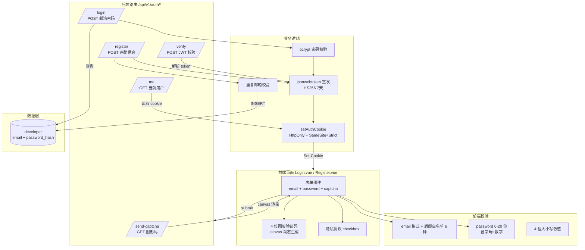
```mermaid
flowchart TB
    subgraph UI["前端页面 Login.vue / Register.vue"]
        FORM[表单组件<br/>email + password + captcha]
        CAPTCHA[4 位图形验证码<br/>canvas 动态生成]
        AGREEMENT[隐私协议 checkbox]
    end

    subgraph VALIDATE["前端校验"]
        EMAIL_RULE[email 格式 + 后缀白名单 6 种]
        PWD_RULE[password 6-20 位<br/>含字母+数字]
        CAPTCHA_RULE[4 位大小写敏感]
    end

    subgraph API["后端路由 /api/v1/auth/*"]
        SEND[/send-captcha<br/>GET 图形码/]
        LOGIN[/login<br/>POST 邮箱密码/]
        REGISTER[/register<br/>POST 完整信息/]
        VERIFY[/verify<br/>POST JWT 校验/]
        ME[/me<br/>GET 当前用户/]
    end

    subgraph BIZ["业务逻辑"]
        BCRYPT[bcrypt 密码校验]
        JWT_SIGN[jsonwebtoken 签发<br/>HS256 7天]
        COOKIE_SET[setAuthCookie<br/>HttpOnly + SameSite=Strict]
        DB_CHECK[重复邮箱校验]
    end

    subgraph DATA["数据层"]
        T1[(developer<br/>email + password_hash)]
    end

    FORM --> EMAIL_RULE
    FORM --> PWD_RULE
    FORM --> CAPTCHA
    FORM --> AGREEMENT
    FORM -->|submit| API
    SEND -->|canvas 渲染| FORM
    LOGIN --> BCRYPT --> JWT_SIGN --> COOKIE_SET -->|Set-Cookie| UI
    LOGIN -->|查询| T1
    REGISTER --> DB_CHECK -->|INSERT| T1
    REGISTER --> JWT_SIGN
    VERIFY -->|解析 token| JWT_SIGN
    ME -->|读取 cookie| COOKIE_SET
```

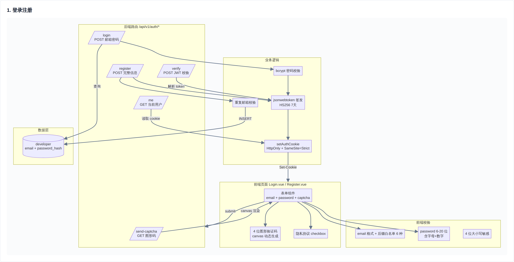

**关键流程**：

| 流程 | 步骤 |
|------|------|
| **注册** | 校验 → 重复邮箱检查 → bcrypt 哈希 → INSERT developer → 签 JWT → 写 Cookie |
| **登录** | 查 email → bcrypt.compare → 签 JWT → 写 Cookie |
| **鉴权** | 优先 `req.cookies.auth_token` → 失败回退 `Authorization: Bearer` |
| **注销** | 清除 Cookie + localStorage + 跳 /login |

---

## 2. 数据看板

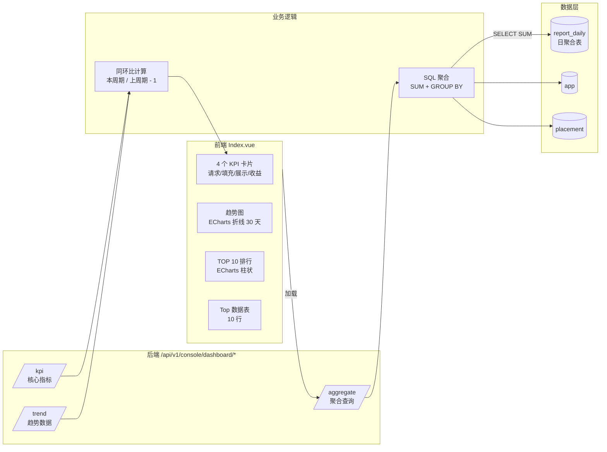
```mermaid
flowchart LR
    subgraph UI["前端 Index.vue"]
        KPI[4 个 KPI 卡片<br/>请求/填充/展示/收益]
        CHART1[趋势图<br/>ECharts 折线 30 天]
        CHART2[TOP 10 排行<br/>ECharts 柱状]
        TABLE[Top 数据表<br/>10 行]
    end

    subgraph API["后端 /api/v1/console/dashboard/*"]
        ENDPOINT_AGG[/aggregate<br/>聚合查询/]
        ENDPOINT_KPI[/kpi<br/>核心指标/]
        ENDPOINT_TREND[/trend<br/>趋势数据/]
    end

    subgraph BIZ["业务逻辑"]
        SQL_AGG[SQL 聚合<br/>SUM + GROUP BY]
        COMPARE[同环比计算<br/>本周期 / 上周期 - 1]
    end

    subgraph DATA["数据层"]
        T1[(report_daily<br/>日聚合表)]
        T2[(app)]
        T3[(placement)]
    end

    UI -->|加载| ENDPOINT_AGG
    ENDPOINT_AGG --> SQL_AGG
    ENDPOINT_KPI --> COMPARE
    ENDPOINT_TREND --> COMPARE
    SQL_AGG -->|SELECT SUM| T1
    SQL_AGG --> T2
    SQL_AGG --> T3
    COMPARE --> KPI
```

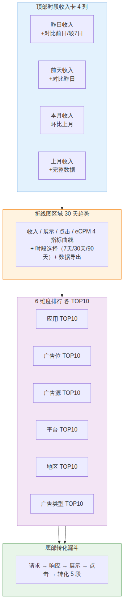

**关键点**：

- 4 个 KPI 卡片：当日总请求/填充/展示/收益（含同环比箭头）
- 趋势图：近 30 天，按天聚合
- TOP 10 排行：可切换应用/广告位/广告源
- 数据源：`report_daily`（按 `developer_id + stat_date` 过滤）

---

## 3. 应用管理

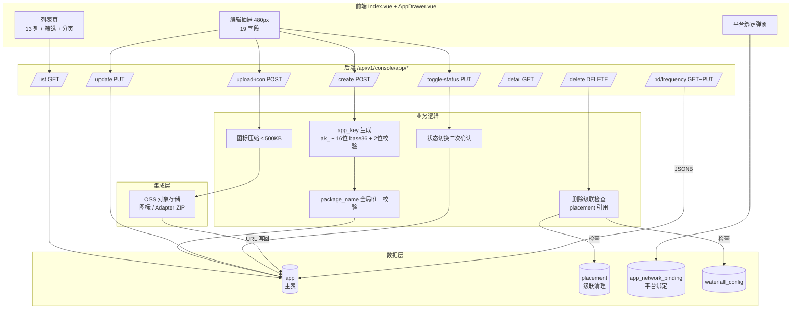
```mermaid
flowchart TB
    subgraph UI["前端 Index.vue + AppDrawer.vue"]
        LIST[列表页<br/>13 列 + 筛选 + 分页]
        DRAWER[编辑抽屉 480px<br/>19 字段]
        BIND_DIALOG[平台绑定弹窗]
    end

    subgraph API["后端 /api/v1/console/app/*"]
        L[/list GET/]
        C[/create POST/]
        U[/update PUT/]
        D[/delete DELETE/]
        T[/toggle-status PUT/]
        DT[/detail GET/]
        UPLOAD[/upload-icon POST/]
        FREQ[/:id/frequency GET+PUT/]
    end

    subgraph BIZ["业务逻辑"]
        GEN_KEY[app_key 生成<br/>ak_ + 16位 base36 + 2位校验]
        UNIQUE_CHECK[package_name 全局唯一校验]
        DELETE_CHECK[删除级联检查<br/>placement 引用]
        CONFIRM[状态切换二次确认]
        COMPRESS[图标压缩 ≤ 500KB]
    end

    subgraph INTEGRATION["集成层"]
        OSS[OSS 对象存储<br/>图标 / Adapter ZIP]
    end

    subgraph DATA["数据层"]
        T1[(app<br/>主表)]
        T2[(placement<br/>级联清理)]
        T3[(app_network_binding<br/>平台绑定)]
        T4[(waterfall_config)]
    end

    LIST --> L
    DRAWER --> C
    DRAWER --> U
    DRAWER --> UPLOAD
    DRAWER --> T
    BIND_DIALOG --> T3
    L --> T1
    C --> GEN_KEY --> UNIQUE_CHECK --> T1
    U --> T1
    D --> DELETE_CHECK
    DELETE_CHECK -->|检查| T2
    DELETE_CHECK -->|检查| T4
    T --> CONFIRM --> T1
    UPLOAD --> COMPRESS --> OSS
    OSS -->|URL 写回| T1
    FREQ -->|JSONB| T1
```

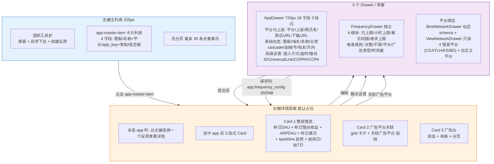

**关键流程**：

| 流程 | 步骤 |
|------|------|
| **新建** | 填表 → 校验 → 生成 app_key → 校验 package_name 唯一 → INSERT → 刷新列表 |
| **编辑** | 加载详情 → 改字段 → 校验 → UPDATE（**app_key/package_name 不可改**） |
| **删除** | 弹确认 → 检查 placement 引用 → 软提醒级联清理 → DELETE |
| **图标上传** | 前端压缩 → 后端校验 MIME → 上 OSS → URL 写回 |
| **平台绑定** | 选择广告平台 + 账号 + 第三方 AppID + Adapter 版本 → INSERT binding |

---

## 4. 广告位管理

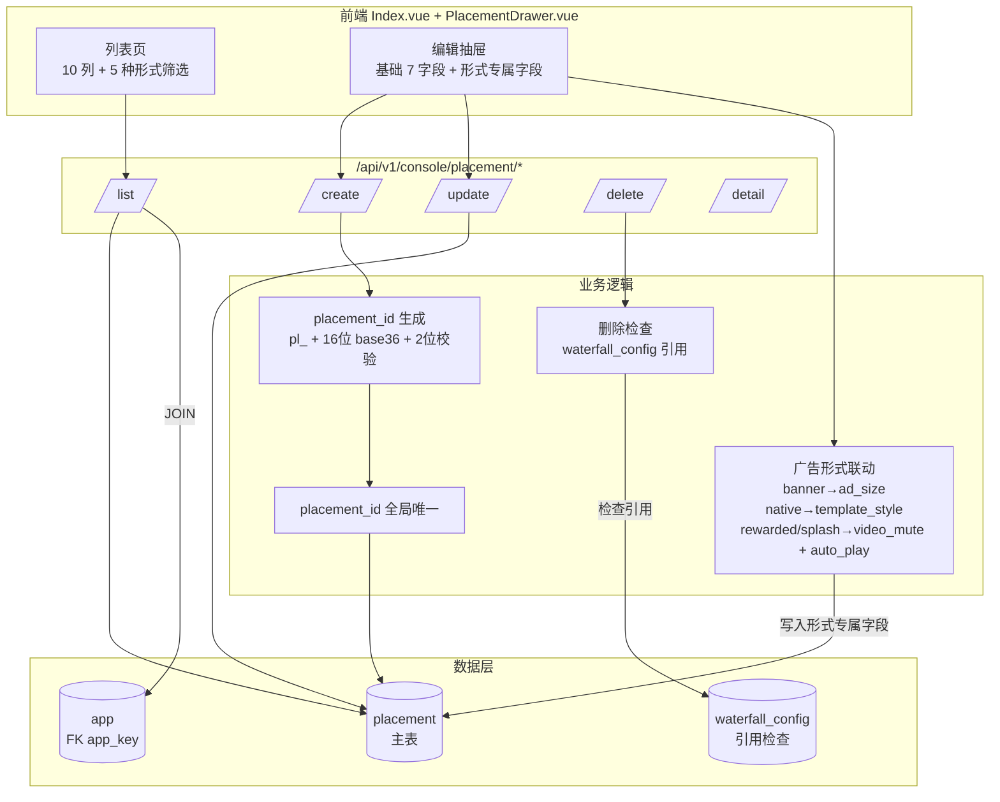
```mermaid
flowchart TB
    subgraph UI["前端 Index.vue + PlacementDrawer.vue"]
        LIST[列表页<br/>10 列 + 5 种形式筛选]
        DRAWER[编辑抽屉<br/>基础 7 字段 + 形式专属字段]
    end

    subgraph BIZ["业务逻辑"]
        GEN_ID[placement_id 生成<br/>pl_ + 16位 base36 + 2位校验]
        FORMAT_LOGIC[广告形式联动<br/>banner→ad_size<br/>native→template_style<br/>rewarded/splash→video_mute + auto_play]
        UNIQUE_CHECK[placement_id 全局唯一]
        DELETE_CHECK[删除检查<br/>waterfall_config 引用]
    end

    subgraph API["/api/v1/console/placement/*"]
        L[/list/]
        C[/create/]
        U[/update/]
        D[/delete/]
        DT[/detail/]
    end

    subgraph DATA["数据层"]
        T1[(placement<br/>主表)]
        T2[(app<br/>FK app_key)]
        T3[(waterfall_config<br/>引用检查)]
    end

    LIST --> L
    DRAWER --> C
    DRAWER --> U
    DRAWER --> FORMAT_LOGIC
    C --> GEN_ID --> UNIQUE_CHECK --> T1
    FORMAT_LOGIC -->|写入形式专属字段| T1
    U --> T1
    D --> DELETE_CHECK -->|检查引用| T3
    L --> T1
    L -->|JOIN| T2
```

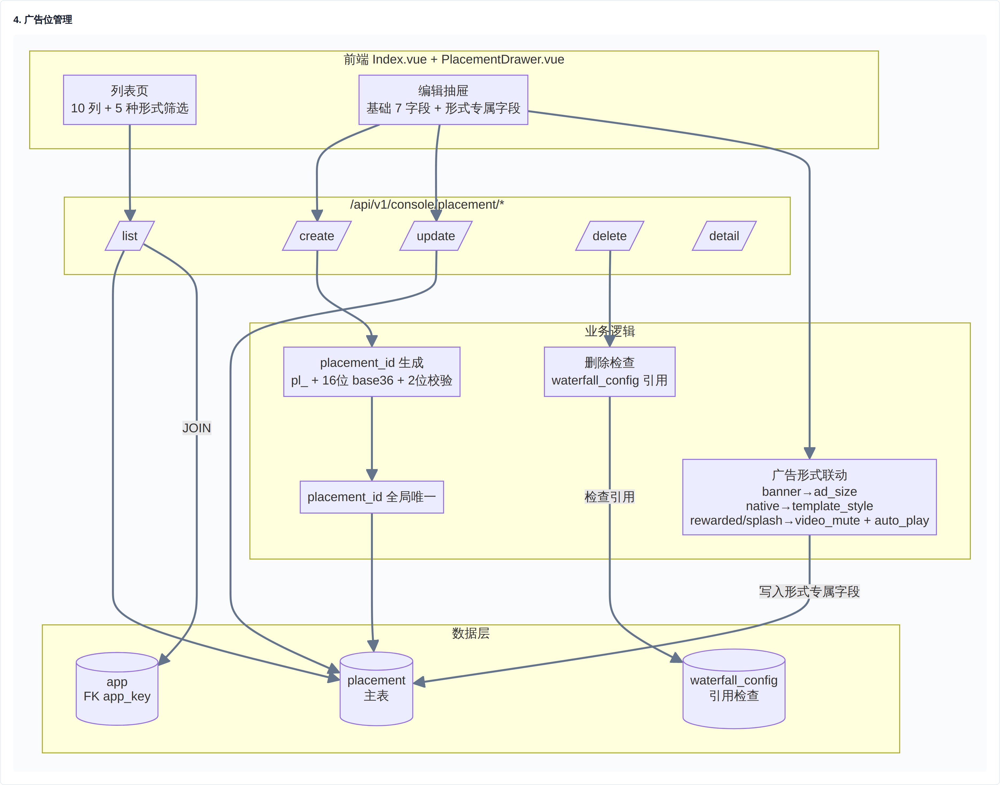

**广告形式字段矩阵**：

| formart | 必填专属字段 |
|---------|-------------|
| 1=banner | `ad_size`（320×50/728×90/300×250/468×60） |
| 2=interstitial | — |
| 3=native | `template_style`（小图/大图/三图/视频流）+ `material_type` |
| 4=rewarded | `video_mute` + `auto_play` |
| 5=splash | `video_mute` + `auto_play` |

---

## 5. 流量分组

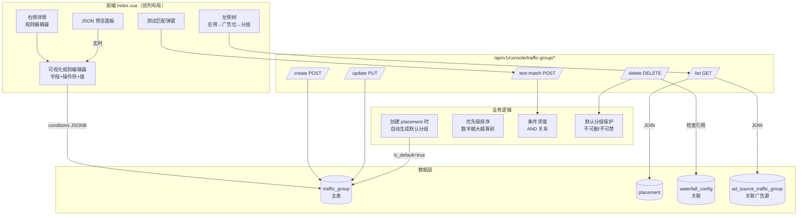
```mermaid
flowchart TB
    subgraph UI["前端 Index.vue（双列布局）"]
        TREE[左侧树<br/>应用→广告位→分组]
        DETAIL[右侧详情<br/>规则编辑器]
        RULE_EDITOR[可视化规则编辑器<br/>字段+操作符+值]
        JSON_PREVIEW[JSON 预览面板]
        TEST_DIALOG[测试匹配弹窗]
    end

    subgraph API["/api/v1/console/traffic-group/*"]
        L[/list GET/]
        C[/create POST/]
        U[/update PUT/]
        D[/delete DELETE/]
        T[/test-match POST/]
    end

    subgraph BIZ["业务逻辑"]
        DEFAULT_GEN[创建 placement 时<br/>自动生成默认分组]
        PRIORITY[优先级排序<br/>数字越大越靠前]
        EVAL[条件求值<br/>AND 关系]
        PROTECT[默认分组保护<br/>不可删/不可禁]
    end

    subgraph DATA["数据层"]
        T1[(traffic_group<br/>主表)]
        T2[(placement)]
        T3[(waterfall_config<br/>关联)]
        T4[(ad_source_traffic_group<br/>关联广告源)]
    end

    TREE --> L
    DETAIL --> RULE_EDITOR
    RULE_EDITOR -->|conditions JSONB| T1
    JSON_PREVIEW -->|实时| RULE_EDITOR
    TEST_DIALOG --> T
    C --> T1
    U --> T1
    D --> PROTECT
    D -->|检查引用| T3
    T --> EVAL
    DEFAULT_GEN -->|is_default=true| T1
    L -->|JOIN| T2
    L -->|JOIN| T4
```

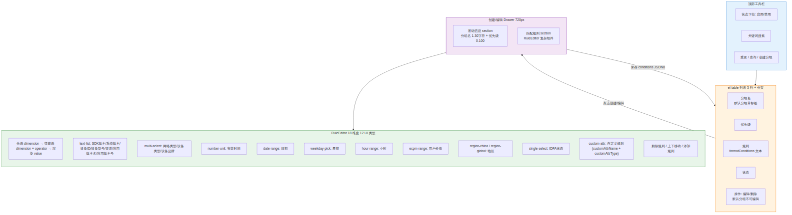

**关键流程**：

| 流程 | 步骤 |
|------|------|
| **创建 placement** | 自动创建 `is_default=true` 的默认分组（条件为空，匹配所有） |
| **新建分组** | 选条件 → 保存 → 落 JSONB → 默认 priority=MAX+1 |
| **匹配逻辑** | SDK 端按 priority DESC 顺序匹配，**第一个条件命中的分组生效** |
| **测试匹配** | 输入模拟 user_context → 调 test-match → 返回是否命中 |
| **删除保护** | 默认分组禁止删；已绑 waterfall_config 禁止删 |

---

## 6. 广告源管理

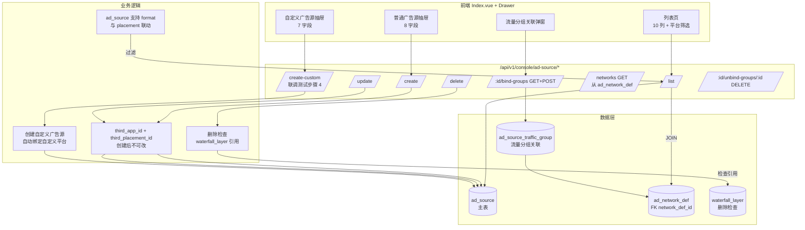
```mermaid
flowchart TB
    subgraph UI["前端 Index.vue + Drawer"]
        LIST[列表页<br/>10 列 + 平台筛选]
        DRAWER[普通广告源抽屉<br/>8 字段]
        CUSTOM_DRAWER[自定义广告源抽屉<br/>7 字段]
        BIND_DLG[流量分组关联弹窗]
    end

    subgraph API["/api/v1/console/ad-source/*"]
        L[/list/]
        C[/create/]
        U[/update/]
        D[/delete/]
        CC[/create-custom<br/>联调测试步骤 4/]
        NET[/networks GET<br/>从 ad_network_def/]
        BG[/:id/bind-groups GET+POST/]
        UBG[/:id/unbind-groups/:id DELETE/]
    end

    subgraph BIZ["业务逻辑"]
        FORMAT_FILTER[ad_source 支持 format<br/>与 placement 联动]
        THIRD_UNIQUE[third_app_id + third_placement_id<br/>创建后不可改]
        DELETE_CHECK[删除检查<br/>waterfall_layer 引用]
        CUSTOM_BIND[创建自定义广告源<br/>自动绑定自定义平台]
    end

    subgraph DATA["数据层"]
        T1[(ad_source<br/>主表)]
        T2[(ad_network_def<br/>FK network_def_id)]
        T3[(ad_source_traffic_group<br/>流量分组关联)]
        T4[(waterfall_layer<br/>删除检查)]
    end

    LIST --> L
    DRAWER --> C
    CUSTOM_DRAWER --> CC
    BIND_DLG --> BG
    L --> T1
    C --> THIRD_UNIQUE --> T1
    U --> THIRD_UNIQUE --> T1
    D --> DELETE_CHECK -->|检查引用| T4
    CC --> CUSTOM_BIND --> T1
    FORMAT_FILTER -->|过滤| L
    L -->|JOIN| T2
    BG --> T3
    T3 --> T2
```

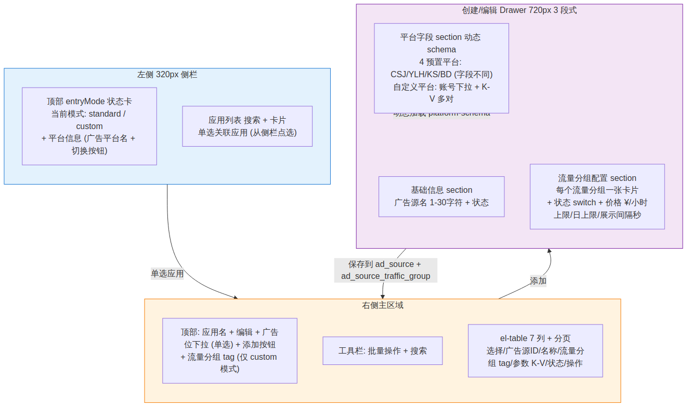

**两套创建路径**：

| 路径 | 用途 | 关联平台 |
|------|------|----------|
| **普通** | 接预置广告平台（穿山甲/优量汇/Sigmob） | `is_preset=true` 的 `ad_network_def` |
| **自定义** | 6 步对接步骤 4 联调测试 | `is_preset=false` 的 `ad_network_def`（仅本 developer） |

---

## 7. 瀑布流配置

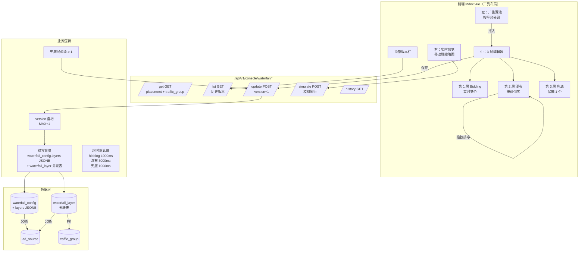
```mermaid
flowchart TB
    subgraph UI["前端 Index.vue（三列布局）"]
        POOL[左：广告源池<br/>按平台分组]
        EDITOR[中：3 层编辑器]
        L1[第 1 层 Bidding<br/>实时竞价]
        L2[第 2 层 瀑布<br/>按价倒序]
        L3[第 3 层 兜底<br/>保底 1 个]
        PREVIEW[右：实时预览<br/>移动端缩略图]
        VERSION_BAR[顶部版本栏]
    end

    subgraph API["/api/v1/console/waterfall/*"]
        GET[/get GET<br/>placement + traffic_group/]
        LIST[/list GET<br/>历史版本/]
        UPD[/update POST<br/>version+1/]
        SIM[/simulate POST<br/>模拟执行/]
        HIST[/history GET/]
    end

    subgraph BIZ["业务逻辑"]
        VER_INC[version 自增<br/>MAX+1]
        DOUBLE_WRITE[双写策略<br/>waterfall_config.layers JSONB<br/>+ waterfall_layer 关联表]
        FALLBACK_CHECK[兜底层必须 ≥ 1]
        TIMEOUT_DEFAULT[超时默认值<br/>Bidding 1000ms<br/>瀑布 3000ms<br/>兜底 1000ms]
    end

    subgraph DATA["数据层"]
        T1[(waterfall_config<br/>+ layers JSONB)]
        T2[(waterfall_layer<br/>关联表)]
        T3[(ad_source)]
        T4[(traffic_group)]
    end

    POOL -->|拖入| EDITOR
    EDITOR --> L1
    EDITOR --> L2
    EDITOR --> L3
    L2 -->|拖拽排序| L2
    PREVIEW --> SIM
    VERSION_BAR --> LIST
    EDITOR -->|保存| UPD
    UPD --> VER_INC --> DOUBLE_WRITE
    DOUBLE_WRITE --> T1
    DOUBLE_WRITE --> T2
    FALLBACK_CHECK --> UPD
    T1 -->|JOIN| T3
    T2 -->|JOIN| T3
    T2 -->|FK| T4
```

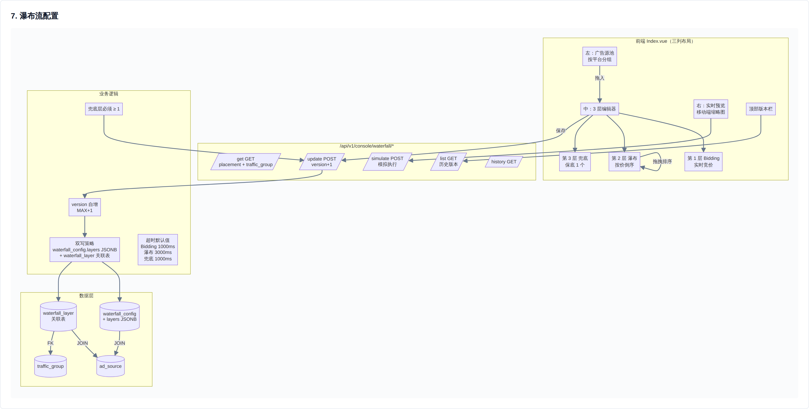

**3 层结构**：

| 层 | type | 行为 | 配置项 |
|----|------|------|--------|
| 1 Bidding | 1 | SDK 端同时请求 | `timeout_ms` + `priority` |
| 2 瀑布 | 2 | 按 `sort_price` 倒序瀑布 | `sort_price` + `timeout_ms` + `status` |
| 3 兜底 | 3 | 保底 1 个 | `sort_price` + `timeout_ms` |

**双写策略**：`waterfall_config.layers` (JSONB 快照) + `waterfall_layer` (关联表) 同时写，`fetchConfig` 优先用 JSONB。

---

## 8. 数据报表

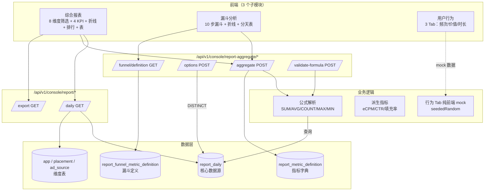
```mermaid
flowchart TB
    subgraph UI["前端（3 个子模块）"]
        OVERVIEW[综合报表<br/>8 维度筛选 + 4 KPI + 折线 + 排行 + 表]
        FUNNEL[漏斗分析<br/>10 步漏斗 + 折线 + 分天表]
        BEHAVIOR[用户行为<br/>3 Tab：频次/价值/时长]
    end

    subgraph API["/api/v1/console/report-aggregate/*"]
        AGG[/aggregate POST/]
        OPT[/options POST/]
        FDEF[/funnel/definition GET/]
        VAL[/validate-formula POST/]
    end

    subgraph API_DAILY["/api/v1/console/report/*"]
        DAILY[/daily GET/]
        EXP[/export GET/]
    end

    subgraph BIZ["业务逻辑"]
        FORMULA_PARSE[公式解析<br/>SUM/AVG/COUNT/MAX/MIN]
        DERIVED[派生指标<br/>eCPM/CTR/填充率]
        MOCK_BEHAVIOR[行为 Tab 纯前端 mock<br/>seededRandom]
    end

    subgraph DATA["数据层"]
        T1[(report_daily<br/>核心数据源)]
        T2[(report_metric_definition<br/>指标字典)]
        T3[(report_funnel_metric_definition<br/>漏斗定义)]
        T4[(app / placement / ad_source<br/>维度表)]
    end

    OVERVIEW --> DAILY
    OVERVIEW --> AGG
    OVERVIEW --> EXP
    FUNNEL --> AGG
    FUNNEL --> FDEF
    BEHAVIOR -.->|mock 数据| MOCK_BEHAVIOR
    AGG --> FORMULA_PARSE -->|查询| T1
    OPT -->|DISTINCT| T1
    VAL --> FORMULA_PARSE
    FDEF --> T3
    AGG --> T2
    DAILY --> T1
    DAILY --> T4
```

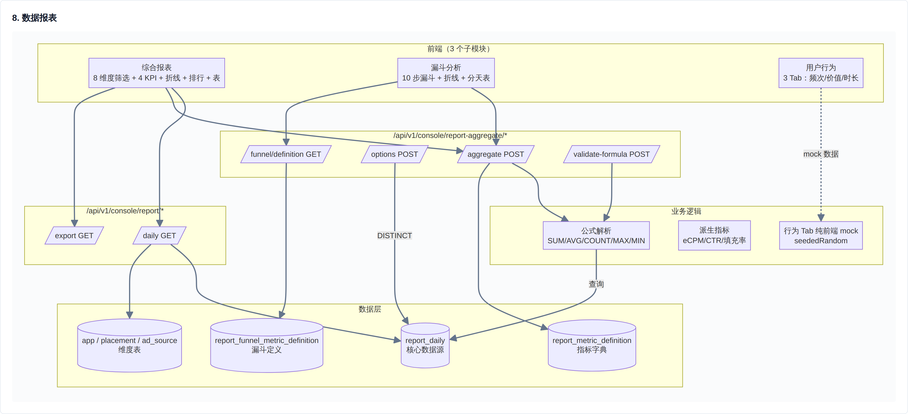

**8 维度筛选联动**：

```
时间 → 应用 → 广告位 → 广告源 → 广告形式 → 广告平台 → 系统 → 国家
                ↑ (依赖应用)    ↑ (依赖应用)        ↑ (ad_network_def)
```

---

## 9. 对账管理

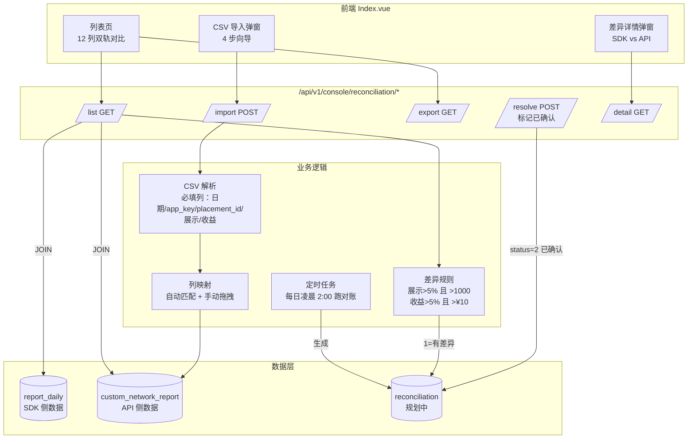
```mermaid
flowchart TB
    subgraph UI["前端 Index.vue"]
        LIST[列表页<br/>12 列双轨对比]
        DETAIL[差异详情弹窗<br/>SDK vs API]
        IMPORT[CSV 导入弹窗<br/>4 步向导]
    end

    subgraph API["/api/v1/console/reconciliation/*"]
        L[/list GET/]
        IMP[/import POST/]
        EXP[/export GET/]
        RES[/resolve POST<br/>标记已确认/]
        DT[/detail GET/]
    end

    subgraph BIZ["业务逻辑"]
        SCHEDULER[定时任务<br/>每日凌晨 2:00 跑对账]
        DIFF_RULE[差异规则<br/>展示>5% 且 >1000<br/>收益>5% 且 >¥10]
        CSV_PARSE[CSV 解析<br/>必填列：日期/app_key/placement_id/展示/收益]
        COL_MAP[列映射<br/>自动匹配 + 手动拖拽]
    end

    subgraph DATA["数据层"]
        T_SDK[(report_daily<br/>SDK 侧数据)]
        T_API[(custom_network_report<br/>API 侧数据)]
        T_RECON[(reconciliation<br/>规划中)]
    end

    LIST --> L
    DETAIL --> DT
    IMPORT --> IMP
    LIST --> EXP
    L --> DIFF_RULE
    L -->|JOIN| T_SDK
    L -->|JOIN| T_API
    SCHEDULER -->|生成| T_RECON
    DIFF_RULE -->|1=有差异| T_RECON
    RES -->|status=2 已确认| T_RECON
    IMP --> CSV_PARSE --> COL_MAP --> T_API
```

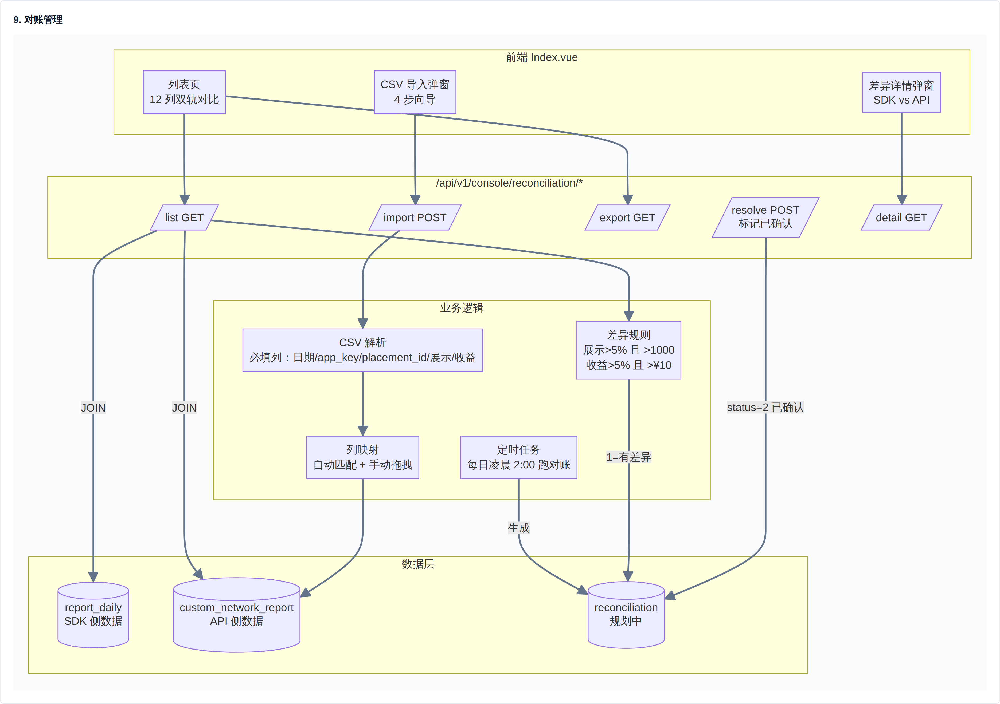

**双轨对比**：

| 维度 | SDK 侧 | API 侧 | 差异 |
|------|--------|--------|------|
| 展示 | `report_daily.impressions` | `custom_network_report.impressions` | API - SDK |
| 收益 | `report_daily.revenue` | `custom_network_report.revenue` | API - SDK |
| 状态 | — | — | 0=待对账 / 1=有差异 / 2=已确认 |

---

## 10. 广告平台 / Adapter

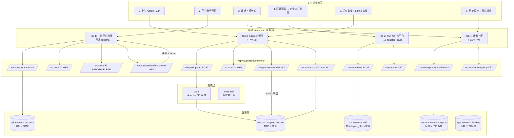
```mermaid
flowchart TB
    subgraph UI["前端 Index.vue（4 Tab）"]
        T1[Tab 1: 广告平台账号<br/>+ 凭证 schema]
        T2[Tab 2: 自定义广告平台<br/>+ 12 adapter_class]
        T3[Tab 3: Adapter 管理<br/>+ 上传 ZIP]
        T4[Tab 4: 数据上报<br/>+ CSV 上传]
    end

    subgraph API["/api/v1/console/network/*"]
        CC[/custom/create POST/]
        CL[/custom/list GET/]
        CS[/custom/adapter/status PUT/]
        AU[/adapter/upload POST/]
        AL[/adapter/list GET/]
        AR[/adapter/review/:id POST/]
        CR[/custom/report/upload POST/]
        CRQ[/custom/report/query GET/]
        AC[/account/create POST/]
        ACL[/account/list GET/]
        ACU[/account/:id PATCH+DELETE/]
        ACS[/account/credential-schema GET/]
    end

    subgraph BIZ["6 步对接流程"]
        S1[1. 上传 Adapter ZIP]
        S2[2. 平台账号凭证]
        S3[3. 数据上报格式]
        S4[4. 联调测试 → 自定义广告源]
        S5[5. 提交审核 + admin 审核]
        S6[6. 维护监控 + 异常消息]
    end

    subgraph INTEGRATION["集成层"]
        OSS[OSS<br/>Adapter ZIP 存储]
        COZE[coze-sdk<br/>拉取第三方]
    end

    subgraph DATA["数据层"]
        D1[(ad_network_def<br/>12 adapter_class 矩阵)]
        D2[(ad_network_account<br/>凭证 JSONB)]
        D3[(custom_adapter_version<br/>MD5 + 状态)]
        D4[(custom_network_report<br/>自定义平台数据)]
        D5[(app_network_binding<br/>应用-平台绑定)]
    end

    T1 --> AC
    T1 --> ACL
    T1 --> ACU
    T1 --> ACS
    T2 --> CC
    T2 --> CL
    T3 --> AU
    T3 --> AL
    T3 --> AR
    T3 --> CS
    T4 --> CR
    T4 --> CRQ
    S1 --> T3
    S2 --> T1
    S3 --> T4
    S4 --> T2
    S5 --> T3
    S6 --> T4

    AU --> OSS --> D3
    AC --> D2
    CC --> D1
    CR --> D4
    CS --> D3
    AR -->|admin 审核| D3
    ACS -->|返回 schema| T1
```

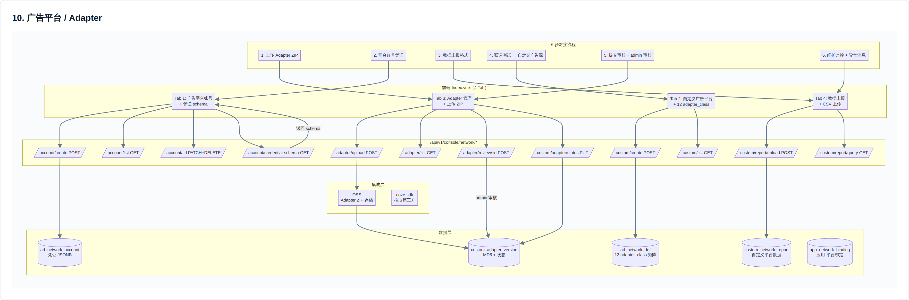

**6 步对接**：

| 步骤 | 落点 | 涉及表 |
|------|------|--------|
| 1 上传 Adapter | Tab 3 | `ad_network_def` + `custom_adapter_version` |
| 2 平台账号 | Tab 1 | `ad_network_account` |
| 3 数据上报 | Tab 4 | `custom_network_report` |
| 4 联调测试 | 广告源 | `ad_source` (is_custom=true) |
| 5 审核上线 | Tab 3 | `custom_adapter_version.status=3` |
| 6 维护监控 | Tab 4 + 消息 | 异常自动发 `message.type=2` |

---

## 11. 消息中心

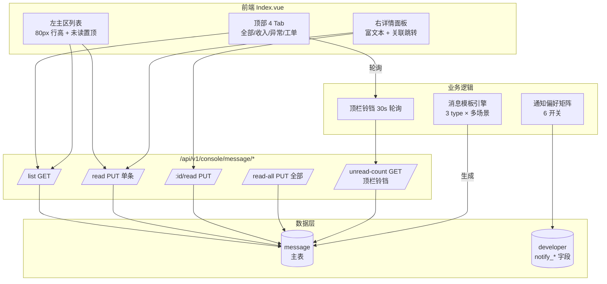
```mermaid
flowchart TB
    subgraph UI["前端 Index.vue"]
        TAB[顶部 4 Tab<br/>全部/收入/异常/工单]
        LIST[左主区列表<br/>80px 行高 + 未读置顶]
        DETAIL[右详情面板<br/>富文本 + 关联跳转]
    end

    subgraph API["/api/v1/console/message/*"]
        L[/list GET/]
        R[/read PUT 单条/]
        RA[/read-all PUT 全部/]
        RID[/:id/read PUT/]
        UC[/unread-count GET<br/>顶栏铃铛/]
    end

    subgraph BIZ["业务逻辑"]
        POLL[顶栏铃铛 30s 轮询]
        TPL_MSG[消息模板引擎<br/>3 type × 多场景]
        NOTIFY_PREF[通知偏好矩阵<br/>6 开关]
    end

    subgraph DATA["数据层"]
        T1[(message<br/>主表)]
        T2[(developer<br/>notify_* 字段)]
    end

    TAB --> L
    LIST --> L
    LIST --> R
    DETAIL --> R
    DETAIL --> RID
    TAB -->|轮询| POLL --> UC
    L --> T1
    R --> T1
    RID --> T1
    RA --> T1
    UC --> T1
    NOTIFY_PREF --> T2
    TPL_MSG -->|生成| T1
```

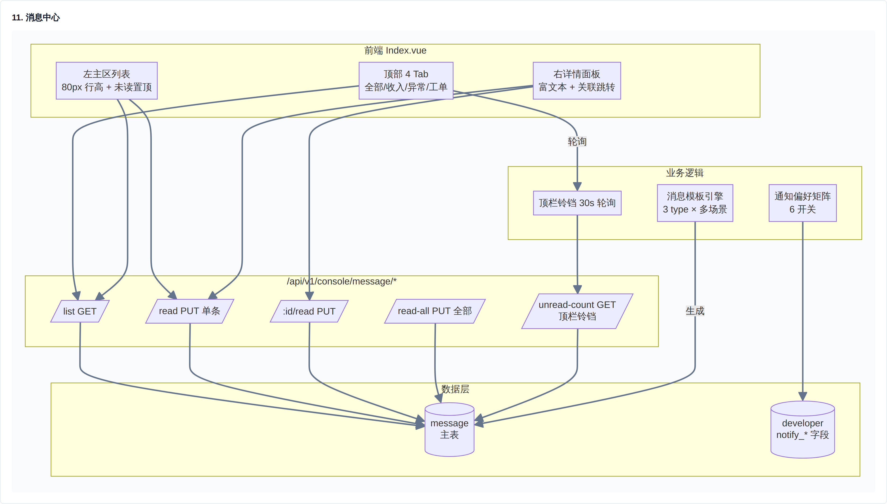

**3 type 触发场景**：

| type | 场景 | 模板 |
|------|------|------|
| 1 收入 | 对账完成 / 收益里程碑 | 「您的 [app] 在 [date] 的对账已完成」 |
| 2 异常 | API 失败 / Adapter 审核被拒 / 数据漏报 | 「[platform] 错误：X」 |
| 3 工单 | 客服回复 / 平台公告 | 富文本内容 |

**6 通知偏好**（developer 表 notify_* 字段）：

|  | 邮件 | 站内 |
|--|------|------|
| 收入 | ✓ | ✓ |
| 异常 | ✓ | ✓ |
| 工单 | ✓ | ✓ |
| 每日摘要 | — | — |

---

## 12. 个人中心

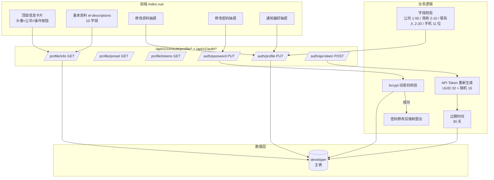
```mermaid
flowchart TB
    subgraph UI["前端 Index.vue"]
        HEADER[顶部信息卡片<br/>头像+公司+操作按钮]
        DESC[基本资料 el-descriptions<br/>10 字段]
        D1[修改资料抽屉]
        D2[修改密码抽屉]
        D3[通知偏好抽屉]
    end

    subgraph API["/api/v1/console/profile/* + /api/v1/auth/*"]
        PI[/profile/info GET/]
        PP[/profile/preset GET/]
        PT[/profile/tokens GET/]
        AP[/auth/profile PUT/]
        AP_PWD[/auth/password PUT/]
        AP_TK[/auth/api-token POST/]
    end

    subgraph BIZ["业务逻辑"]
        VALIDATE[字段校验<br/>公司 1-50 / 简称 2-10 / 联系人 2-20 / 手机 11 位]
        BCRYPT_PWD[bcrypt 旧密码校验]
        FORCE_LOGOUT[密码修改后强制登出]
        TOKEN_REGEN[API Token 重新生成<br/>UUID 32 + 随机 16]
        EXPIRE[过期时间<br/>30 天]
    end

    subgraph DATA["数据层"]
        T1[(developer<br/>主表)]
    end

    HEADER --> PI
    DESC --> PI
    D1 --> AP
    D2 --> AP_PWD
    D3 --> AP
    AP_PWD --> BCRYPT_PWD -->|成功| FORCE_LOGOUT
    AP_TK --> TOKEN_REGEN --> EXPIRE --> T1
    AP --> T1
    PI --> T1
    VALIDATE --> AP
    BCRYPT_PWD --> T1
```

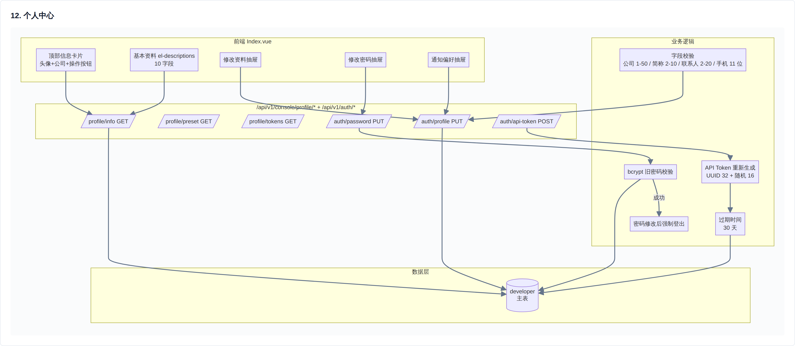

**4 个操作**：

| 操作 | 接口 | 副作用 |
|------|------|--------|
| 修改资料 | `PUT /auth/profile` | 仅改 4 字段（公司/简称/联系人/电话） |
| 修改密码 | `PUT /auth/password` | 强登出 + 清 cookie + 清 localStorage |
| 通知偏好 | `PUT /auth/profile`（含 notify_*） | 6 开关 |
| 退出登录 | `POST /auth/logout` | 清 cookie + 跳 /login |

---

## 13. 超级管理员

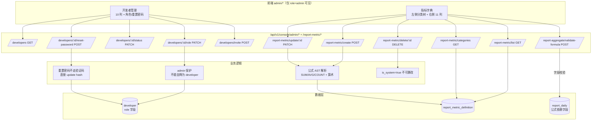
```mermaid
flowchart TB
    subgraph UI["前端 admin/*（仅 role=admin 可见）"]
        D1[开发者管理<br/>10 列 + 角色/重置密码]
        D2[指标字典<br/>左侧分类树 + 右侧 11 列]
    end

    subgraph API["/api/v1/console/admin/* + /report-metric/*"]
        DL[/developers GET/]
        DR[/developers/:id/role PATCH/]
        DS[/developers/:id/status PATCH/]
        DRP[/developers/:id/reset-password POST/]
        DI[/developers/invite POST/]
        ML[/report-metric/list GET/]
        MC[/report-metric/categories GET/]
        MCR[/report-metric/create POST/]
        MU[/report-metric/update/:id PATCH/]
        MD[/report-metric/delete/:id DELETE/]
        FV[/report-aggregate/validate-formula POST/]
    end

    subgraph BIZ["业务逻辑"]
        PROTECT[admin 保护<br/>不能自降为 developer]
        RESET_PWD[重置密码不走验证码<br/>直接 update hash]
        FORMULA_PARSE[公式 AST 解析<br/>SUM/AVG/COUNT + 算术]
        SYSTEM_LOCK[is_system=true 不可删改]
    end

    subgraph DATA["数据层"]
        T1[(developer<br/>role 字段)]
        T2[(report_metric_definition)]
        T3[(report_daily<br/>公式依赖字段)]
    end

    D1 --> DL
    D1 --> DR
    D1 --> DS
    D1 --> DRP
    D1 --> DI
    D2 --> ML
    D2 --> MC
    D2 --> MCR
    D2 --> MU
    D2 --> MD
    D2 --> FV

    DR --> PROTECT --> T1
    DRP --> RESET_PWD --> T1
    ML --> T2
    MC --> T2
    MCR --> FORMULA_PARSE --> T2
    MU --> FORMULA_PARSE
    FV -->|字段校验| T3
    MD --> SYSTEM_LOCK
```

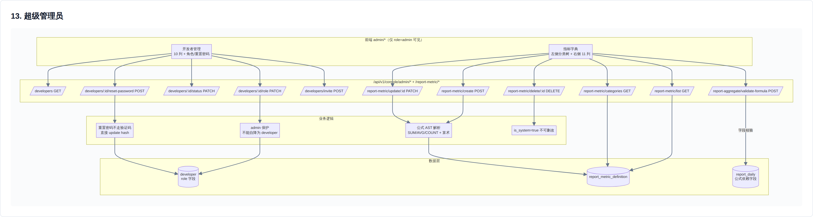

**两个子模块**：

| 模块 | 功能 | 权限 |
|------|------|------|
| **开发者管理** | 改角色 / 启停 / 重置密码 / 邀请 | admin only |
| **指标字典** | 创建/编辑/删除派生指标 + 公式校验 | admin only |

**公式语法**：

```
支持: SUM(field) / AVG(field) / COUNT(field) / MAX(field) / MIN(field)
支持: + - * / 和数字常量
示例: SUM(revenue) * 1000 / SUM(impressions)   -- eCPM
```

---

## 附录：模块依赖关系图

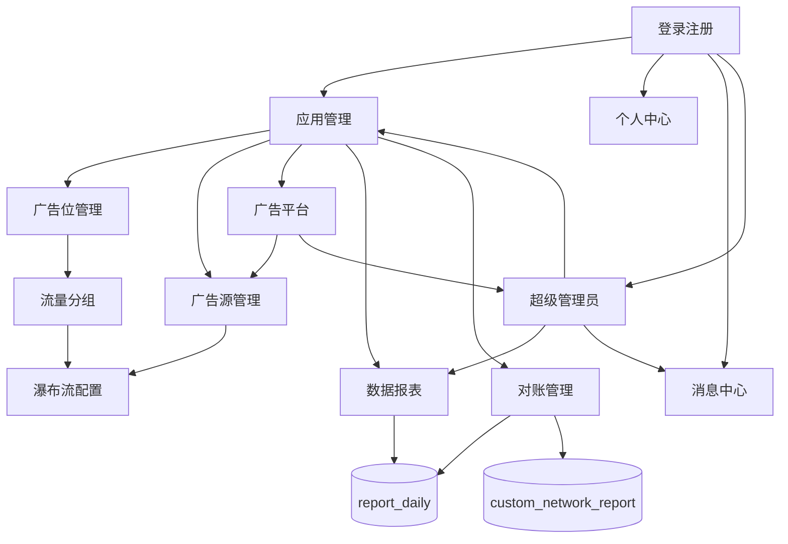
```mermaid
graph TB
    A[登录注册] --> D[应用管理]
    A --> L[个人中心]
    A --> M[消息中心]

    D --> P[广告位管理]
    D --> APPSRC[广告源管理]
    D --> NET[广告平台]
    D --> R[数据报表]
    D --> REC[对账管理]

    P --> TG[流量分组]
    TG --> WF[瀑布流配置]
    APPSRC --> WF
    NET --> APPSRC

    R --> DB[(report_daily)]
    REC --> DB
    REC --> API_DB[(custom_network_report)]

    A --> ADM[超级管理员]
    ADM --> D
    ADM --> R
    ADM --> M

    NET --> ADM
```

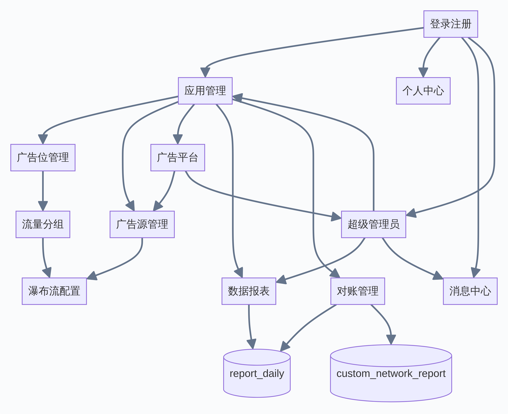

**依赖关系说明**：

| 上游 | 下游 | 关系 |
|------|------|------|
| 应用 | 广告位 | 1:N（删应用级联删广告位） |
| 广告位 | 流量分组 | 1:N（建广告位自动建默认分组） |
| 流量分组 | 瀑布流配置 | 1:1（一组一个 config） |
| 广告源 | 瀑布流层 | N:N（多个 ad_source 进多个 layer） |
| 报表 | 全部业务表 | 聚合查询（不引用外键） |

---

**最后更新**：2026-07-17
**作者**：通用网页搭建专家
