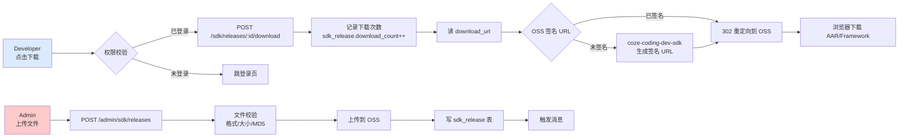
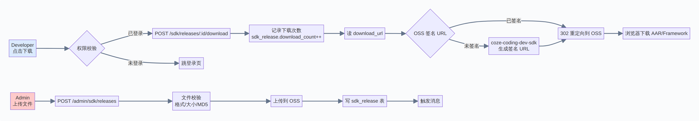

# SDK 管理模块 — 产品设计文档

> 版本：v1.0  
> 适用对象：聚合平台 SDK 中心  
> 设计目标：让开发者一站式获取 SDK 集成全链路（下载 / 文档 / 隐私 / changelog）

---

## 1. 功能定位

| 角色 | 能用 | 不能用 |
|------|------|--------|
| **developer**（登录开发者） | 浏览版本、下载 SDK、查看文档、查看隐私政策 | 发布新版本、编辑文档 |
| **admin**（超级管理员） | 上述全部 + 发布新版本、编辑文档、维护隐私政策版本 | — |
| **未登录** | 浏览公开信息（首页、隐私政策） | 下载、查看完整文档受限 |

> **与现有系统的关系**：
> - `custom_adapter_version`（自定义广告平台 Adapter）≠ 本 SDK（聚合平台 SDK 本身）。两者独立。
> - `app.access_type = 1`（SDK 接入）的应用才需要此模块的 SDK。

---

## 2. 整体架构图

```mermaid
flowchart TB
    subgraph 角色层
        DEV[👤 Developer<br/>登录开发者]
        ADM[🛡️ Admin<br/>超级管理员]
    end

    subgraph 表现层[Vue 3 前端 - 6 个页面]
        P1[/sdk<br/>首页/概览/下载]
        P2[/sdk/release<br/>版本历史]
        P3[/sdk/release/:id<br/>版本详情]
        P4[/sdk/docs<br/>技术文档]
        P5[/sdk/privacy<br/>隐私政策]
        P6[/sdk/upload<br/>admin发布新版本]
    end

    subgraph 应用层[Express 后端 - SDK 路由]
        SDK_LIST[GET /sdk/releases<br/>GET /sdk/releases/latest<br/>GET /sdk/releases/:id]
        SDK_DL[GET /sdk/releases/:id/download<br/>下载 + 计数]
        SDK_DOC[GET /sdk/docs<br/>GET /sdk/docs/:slug]
        SDK_PRV[GET /sdk/privacy/current]
        SDK_UPLOAD[POST /admin/sdk/releases<br/>PUT/DELETE /admin/sdk/releases/:id]
        SDK_DOC_ADMIN[POST/PUT/DELETE<br/>/admin/sdk/docs]
        SDK_PRV_ADMIN[POST /admin/sdk/privacy<br/>切换 current]
    end

    subgraph 集成层[coze-coding-dev-sdk]
        OSS[对象存储<br/>AAR/Framework ZIP]
    end

    subgraph 数据层[Supabase PostgreSQL]
        T1[(sdk_release<br/>版本信息)]
        T2[(sdk_doc_category<br/>文档分类)]
        T3[(sdk_doc<br/>文档内容)]
        T4[(sdk_privacy<br/>隐私政策)]
    end

    DEV --> P1
    DEV --> P2
    DEV --> P3
    DEV --> P4
    DEV --> P5
    ADM --> P6
    ADM -.管理.-> P1
    ADM -.管理.-> P2
    ADM -.管理.-> P4
    ADM -.管理.-> P5

    P1 --> SDK_LIST
    P2 --> SDK_LIST
    P3 --> SDK_LIST
    P1 --> SDK_DL
    P2 --> SDK_DL
    P3 --> SDK_DL
    P4 --> SDK_DOC
    P5 --> SDK_PRV
    P6 --> SDK_UPLOAD
    P4 --> SDK_DOC_ADMIN
    P5 --> SDK_PRV_ADMIN

    SDK_LIST --> T1
    SDK_DOC --> T2
    SDK_DOC --> T3
    SDK_PRV --> T4
    SDK_UPLOAD --> T1
    SDK_UPLOAD --> OSS
    SDK_DOC_ADMIN --> T2
    SDK_DOC_ADMIN --> T3
    SDK_PRV_ADMIN --> T4

    SDK_DL -.302 redirect.-> OSS

    style DEV fill:#DBEAFE,stroke:#3B82F6
    style ADM fill:#FECACA,stroke:#EF4444
    style P6 fill:#FEF3C7,stroke:#F59E0B
```


---

## 3. 页面结构

### 3.1 路由清单

| 路径 | 名称 | 鉴权 | 角色 |
|------|------|------|------|
| `/sdk` | SDK 首页（概览 + 下载） | ✅ 登录 | dev + admin |
| `/sdk/release` | 版本历史列表 | ✅ 登录 | dev + admin |
| `/sdk/release/:id` | 版本详情 | ✅ 登录 | dev + admin |
| `/sdk/docs` | 技术文档首页 | ✅ 登录 | dev + admin |
| `/sdk/docs/:slug` | 单篇文档 | ✅ 登录 | dev + admin |
| `/sdk/privacy` | 隐私政策 | ✅ 登录 | dev + admin |
| `/sdk/upload` | 发布新版本 | ✅ 登录 + admin | **admin only** |

### 3.2 侧边栏菜单

在「广告平台」与「消息中心」之间插入「SDK 管理」：

| 菜单 | 图标 | 路径 |
|------|------|------|
| **SDK 管理** | `Box` / `Connection` | `/sdk`（子菜单折叠） |
| └ SDK 概览 | — | `/sdk` |
| └ 版本历史 | — | `/sdk/release` |
| └ 技术文档 | — | `/sdk/docs` |
| └ 隐私政策 | — | `/sdk/privacy` |

admin 角色在「SDK 管理」下方额外显示「发布新版本」（橙色高亮）。

---

## 4. 详细页面 UI 设计

### 4.1 SDK 首页 `/sdk`

```
┌──────────────────────────────────────────────────────────┐
│ 🟦 聚合平台 SDK                                            │
│    v2.5.0 · Android · iOS · 小体积高性能                    │
│    [⬇ 下载 Android AAR]  [⬇ 下载 iOS Framework]            │
├─────────────────────┬────────────────────────────────────┤
│ 📋 导航              │  📌 最新版本                          │
│                     │  ──────────                          │
│ 📦 下载              │  v2.5.0 (2026-07-25 发布)            │
│ 📜 版本历史          │  ✨ 新功能                            │
│ 📚 技术文档          │   • 激励视频支持 30s 倒计时          │
│ 🔒 隐私政策          │   • GDPR 合规接口                    │
│ ⚖️ 许可协议          │  🔧 优化                              │
│                     │   • 启动耗时降低 200ms                │
│                     │  🐛 修复                              │
│                     │   • 无回调偶发问题 (#123)             │
│                     │  [查看完整 changelog]                 │
│                     │                                    │
│                     │  🚀 5 分钟集成                       │
│                     │  1. 添加依赖                          │
│                     │  2. 配置 app_key                      │
│                     │  3. SDK 初始化                       │
│                     │  4. 请求第一个广告                    │
│                     │  [查看完整集成指南]                   │
│                     │                                    │
│                     │  📊 数据                              │
│                     │  • 总下载：12.5K                      │
│                     │  • 当前稳定版：v2.5.0                 │
│                     │  • 最新预览版：v2.6.0-beta.1         │
└─────────────────────┴────────────────────────────────────┘
```

**实现要点**：
- Hero 区使用渐变背景（`#1E3A8A → #3B82F6`）
- 「下载」按钮：根据当前 developer 第一个 app 的 platform 自动推荐，弹窗可切换
- 「最新版本」卡片：调 `/sdk/releases/latest`（按 `is_latest=true` 取）
- 「5 分钟集成」区域：链向 `/sdk/docs/quick-start`

### 4.2 版本历史 `/sdk/release`

**筛选区**（左侧 240px）：

```
┌──────────────┐
│ 平台          │
│ ☐ Android    │
│ ☐ iOS        │
│              │
│ 状态          │
│ ☑ 稳定       │
│ ☐ 灰度       │
│ ☐ 废弃       │
│              │
│ 关键字        │
│ [v2.5...]    │
│              │
│ [清空筛选]    │
└──────────────┘
```

**主表格**（12 列）：

| # | 列 | 字段 | 渲染 |
|---|----|------|------|
| 1 | 版本 | `version` | monospace + 「最新」金色徽章 |
| 2 | 平台 | `platform` | 标签：Android(蓝) / iOS(绿) |
| 3 | 大小 | `file_size` | 格式化（MB / KB） |
| 4 | MD5 | `file_md5` | monospace 12 字符截断 + hover 完整 |
| 5 | 最低 OS | `min_os_version` | — |
| 6 | 灰度 | `rollout_pct` | 仅灰度状态显示 0-100% |
| 7 | 状态 | `status` | 标签：草稿(灰) / 灰度(黄) / 稳定(绿) / 废弃(红) |
| 8 | 发布时间 | `release_date` | yyyy-MM-dd HH:mm |
| 9 | 下载次数 | `download_count` | 数字 + 千分位 |
| 10 | 操作 | — | 详情 / 下载 / admin:编辑 / 废弃 |

admin 角色额外列：

| 11 | 创建人 | `created_by` | admin 邮箱 |
| 12 | 管理 | — | [编辑] [废弃] [撤回发布] |

**行 hover**：背景 `#F8FAFC` + 左侧 3px 蓝条

**空状态**：插画 + 「该筛选下无版本」

### 4.3 版本详情 `/sdk/release/:id`

**顶部信息条**：

```
┌──────────────────────────────────────────────────────────┐
│ ← 返回版本历史                                            │
│                                                          │
│  v2.5.0     [Android] [稳定] [最新]                       │
│  发布于 2026-07-25 14:30 · 由 admin@adtalos.com 发布     │
│                                                          │
│  [⬇ 下载 AAR (1.2 MB)]   [📋 复制集成代码]   [⚠ 举报]    │
└──────────────────────────────────────────────────────────┘
```

**Tab 1：变更说明（changelog）**

3 个子区：
- ✨ **新功能**（绿色 #059669）— feature 列表
- 🔧 **优化**（蓝色 #2563EB）— improve 列表
- 🐛 **修复**（红色 #DC2626）— fix 列表

每条记录：
- 标题
- 关联 issue 链接（`#123`）
- hover 显示详细描述

**Tab 2：技术信息**

| 字段 | 值 |
|------|-----|
| 文件名 | `adtalos-sdk-android-2.5.0.aar` |
| 文件大小 | 1.2 MB（1,234,567 字节） |
| MD5 | `abc12345...def67890` |
| 最低运行 SDK 版本 | 2.0.0 |
| 最低系统版本 | Android 5.0 (API 21) |
| 权限 | `INTERNET`, `ACCESS_NETWORK_STATE` |
| 签名 | SHA-1: `...` |

**Tab 3：升级指南**

针对上一版本（v2.4.x → v2.5.0）的迁移步骤：
1. 修改 `build.gradle` 版本号
2. 更新 `AndroidManifest.xml` 权限
3. 重新打包

如果是大版本（如 1.x → 2.x），列出 breaking changes。

**Tab 4：admin 专属「管理」**

- 切换状态（草稿/灰度/稳定/废弃）
- 编辑 changelog
- 调整灰度比例
- 撤回发布
- 复制版本（基于此版本创建新版本草稿）

### 4.4 技术文档 `/sdk/docs`

**左侧分类树**（280px）：

```
📁 快速开始
   ├─ 📄 接入
   ├─ 📄 初始化
   └─ 📄 配置
📁 集成指南
   ├─ 📄 激励视频
   ├─ 📄 信息流
   ├─ 📄 开屏
   └─ 📄 横幅
📁 API 参考
   ├─ 📄 AdSdk 类
   ├─ 📄 AdSlot 类
   └─ 📄 回调接口
📁 高级功能
   ├─ 📄 GDPR 合规
   ├─ 📄 CCPA 合规
   └─ 📄 频次控制
📁 常见问题
   ├─ 📄 集成报错
   ├─ 📄 收益问题
   └─ 📄 数据回传
```

**右侧文章区**：

- 顶部面包屑：`快速开始 / 接入`
- 标题
- 最后更新时间 + 浏览次数
- Markdown 渲染内容
- 代码块高亮（vue-prism / highlight.js）
- 底部：上一篇 / 下一篇导航

**admin 多一个悬浮「编辑」按钮**（右上角 fixed），点击进入 admin 编辑模式（双栏 Markdown 编辑器 + 实时预览）。

### 4.5 隐私政策 `/sdk/privacy`

**顶部**：

```
┌──────────────────────────────────────────────────────────┐
│ 🔒 隐私政策                                                │
│                                                          │
│ 当前生效版本：v3.2                                        │
│ 生效日期：2026-06-01                                      │
│                                                          │
│ [📋 复制到剪贴板]  [📧 联系 DPO]  [⬇ 离线下载 PDF]          │
└──────────────────────────────────────────────────────────┘
```

**Markdown 渲染区**（全宽）：

- 章节标题
- 列表
- 表格
- 链接

**底部历史版本下拉**：

```
历史版本
  v3.2  2026-06-01  ← 当前
  v3.1  2025-12-01
  v3.0  2025-06-01
  v2.x  2024-12-01
```

点击历史版本 → 切换显示（不弹窗，URL 变化 `/sdk/privacy?version=v3.1`）

### 4.6 admin 发布新版本 `/sdk/upload`（admin only）

**表单字段**（从上到下）：

| # | 字段 | key | 必填 | 校验 | 默认 |
|---|------|-----|------|------|------|
| 1 | 平台 | `platform` | ✅ | 1/2 | 1 (Android) |
| 2 | 版本号 | `version` | ✅ | semver 格式 | — |
| 3 | version_code | `version_code` | ✅ | 整数 ≥ 1 | 1 |
| 4 | 上传文件 | `file` | ✅ | AAR/Framework/ZIP, ≤ 50MB | — |
| 5 | 最低 OS | `min_os_version` | ✅ | 字符串 | Android 5.0 / iOS 12 |
| 6 | 最低 SDK 版本 | `sdk_min_version` | ❌ | semver | — |
| 7 | 权限列表 | `permissions` | ❌ | 多行 textarea | — |
| 8 | changelog.feature | — | ❌ | 多行 | — |
| 9 | changelog.improve | — | ❌ | 多行 | — |
| 10 | changelog.fix | — | ❌ | 多行 | — |
| 11 | 升级指南 | `upgrade_guide` | ❌ | 多行 | — |
| 12 | 状态 | `status` | ✅ | 1=草稿/2=灰度/3=发布 | 1 (草稿) |
| 13 | 灰度比例 | `rollout_pct` | 条件 | 0-100 | 0 (仅 status=2 必填) |

**底部操作**：

- [保存草稿]（左）
- [发布]（右，主色，发布前会再次确认）

**发布后**：
1. 上传文件到 OSS
2. 计算 MD5
3. 写入 `sdk_release` 表
4. 触发「版本更新」类消息给所有 developer（通过 `message` 表）
5. 顶栏铃铛显示红点

---

## 5. 功能架构（每子模块详细）

### 5.1 SDK 下载功能架构





### 5.2 SDK 版本管理功能架构

```mermaid
flowchart TB
    subgraph 前端
        LIST[/sdk/release<br/>列表]
        DETAIL[/sdk/release/:id<br/>详情]
        UPLOAD[/sdk/upload<br/>admin上传]
    end

    subgraph 接口层
        I1[GET /sdk/releases<br/>list with filter]
        I2[GET /sdk/releases/latest]
        I3[GET /sdk/releases/:id]
        I4[POST /admin/sdk/releases]
        I5[PUT /admin/sdk/releases/:id]
        I6[DELETE /admin/sdk/releases/:id]
        I7[POST /admin/sdk/releases/:id/rollback]
    end

    subgraph 业务层
        SVC1[ReleaseService.list<br/>filter: platform/status/keyword]
        SVC2[ReleaseService.getLatest<br/>is_latest=true]
        SVC3[ReleaseService.publish<br/>validate + upload + insert]
        SVC4[ReleaseService.rollback<br/>status: 发布→废弃]
        SVC5[ReleaseService.transition<br/>状态机校验]
    end

    subgraph 集成层
        S3[OSS 上传/下载]
        MSG[消息中心<br/>版本更新通知]
    end

    subgraph 数据层
        DB1[(sdk_release)]
    end

    LIST --> I1
    DETAIL --> I2
    DETAIL --> I3
    UPLOAD --> I4
    UPLOAD --> I5
    DETAIL --> I6
    DETAIL --> I7

    I1 --> SVC1
    I2 --> SVC2
    I3 --> SVC1
    I4 --> SVC3
    I5 --> SVC3
    I5 --> SVC5
    I6 --> SVC4
    I7 --> SVC4

    SVC1 --> DB1
    SVC2 --> DB1
    SVC3 --> S3
    SVC3 --> DB1
    SVC3 --> MSG
    SVC4 --> DB1
    SVC5 --> DB1
```


### 5.3 SDK 文档功能架构

```mermaid
flowchart TB
    subgraph 前端
        DOCS[/sdk/docs<br/>分类+列表]
        DOC[/sdk/docs/:slug<br/>单篇]
        EDIT[/admin/sdk/docs<br/>admin编辑]
    end

    subgraph 接口层
        J1[GET /sdk/docs<br/>分类树]
        J2[GET /sdk/docs/:slug<br/>单篇+增加浏览]
        J3[POST /admin/sdk/docs]
        J4[PUT /admin/sdk/docs/:id]
        J5[DELETE /admin/sdk/docs/:id]
        J6[PUT /admin/sdk/docs/category/sort<br/>排序]
    end

    subgraph 业务层
        K1[DocService.tree<br/>分类+文档聚合]
        K2[DocService.getBySlug<br/>cache + view_count++]
        K3[DocService.upsert<br/>slug unique 校验]
        K4[DocService.reorder<br/>拖拽 sort_order 更新]
    end

    subgraph 数据层
        DB1[(sdk_doc_category)]
        DB2[(sdk_doc)]
    end

    DOCS --> J1
    DOC --> J2
    EDIT --> J3
    EDIT --> J4
    EDIT --> J5
    DOCS --> J6

    J1 --> K1
    J2 --> K2
    J3 --> K3
    J4 --> K3
    J5 --> K3
    J6 --> K4

    K1 --> DB1
    K1 --> DB2
    K2 --> DB2
    K3 --> DB2
    K3 --> DB1
    K4 --> DB2
```


### 5.4 隐私政策功能架构

```mermaid
flowchart TB
    subgraph 前端
        PRV[/sdk/privacy<br/>当前生效]
        HIST[历史版本下拉]
        PRVADMIN[/admin/sdk/privacy<br/>admin维护]
    end

    subgraph 接口层
        L1[GET /sdk/privacy/current]
        L2[GET /sdk/privacy/list<br/>所有历史]
        L3[GET /sdk/privacy/:version]
        L4[POST /admin/sdk/privacy<br/>新版本]
        L5[PUT /admin/sdk/privacy/:id/set-current<br/>切换生效]
    end

    subgraph 业务层
        M1[PrivacyService.getCurrent<br/>is_current=true]
        M2[PrivacyService.publish<br/>set is_current=true on others=false]
    end

    subgraph 数据层
        DB[(sdk_privacy)]
    end

    PRV --> L1
    HIST --> L3
    PRVADMIN --> L4
    PRVADMIN --> L5

    L1 --> M1
    L4 --> M2
    L5 --> M2

    M1 --> DB
    M2 --> DB
```


---

## 6. 关键库表结构

### 6.1 `sdk_release` 表

| 字段 | 类型 | 必填 | 默认 | 业务规则 |
|------|------|------|------|----------|
| `id` | bigserial PK | ✅ | seq | 自增 |
| `platform` | smallint | ✅ | — | 1=Android / 2=iOS |
| `version` | varchar(20) | ✅ | — | semver，如 `2.5.0` |
| `version_code` | integer | ✅ | 1 | 内部递增 code |
| `changelog` | jsonb | ✅ | `{}` | `{feature, improve, fix}` |
| `download_url` | varchar(500) | ✅ | — | OSS URL |
| `file_name` | varchar(200) | ✅ | — | 显示名 |
| `file_size` | bigint | ✅ | — | 字节 |
| `file_md5` | varchar(64) | ❌ | NULL | MD5 |
| `sdk_min_version` | varchar(20) | ❌ | NULL | 最低运行 SDK 版本 |
| `min_os_version` | varchar(50) | ❌ | NULL | 最低 OS |
| `permissions` | jsonb | ❌ | `[]` | 所需权限数组 |
| `release_date` | timestamptz | ✅ | now() | 发布时间 |
| `status` | smallint | ✅ | 1 | 1=草稿 / 2=灰度 / 3=发布 / 4=废弃 |
| `rollout_pct` | smallint | ❌ | 0 | 灰度比例 0-100 |
| `is_latest` | boolean | ❌ | false | 最新稳定版 |
| `deprecate_tip` | text | ❌ | NULL | 废弃提示 |
| `download_count` | integer | ❌ | 0 | 下载次数累加 |
| `created_by` | varchar(50) | ❌ | NULL | admin developer_id |
| `created_at` | timestamptz | ❌ | now() | — |
| `updated_at` | timestamptz | ❌ | now() | — |

**索引**：
- `UNIQUE(platform, version)`
- `(platform, status, is_latest)` 复合索引（最新稳定版查询）
- `(status, release_date DESC)` 时间排序

**changelog JSONB 结构**：

```json
{
  "feature": [
    { "title": "激励视频支持 30s 倒计时", "issue": null, "desc": null }
  ],
  "improve": [
    { "title": "启动耗时降低 200ms", "issue": "#98", "desc": "通过懒加载优化" }
  ],
  "fix": [
    { "title": "无回调偶发问题", "issue": "#123", "desc": "修复 onAdLoadFailed 偶发不触发" }
  ]
}
```

### 6.2 `sdk_doc` 表

| 字段 | 类型 | 必填 | 默认 | 业务规则 |
|------|------|------|------|----------|
| `id` | bigserial PK | ✅ | seq | 自增 |
| `category_id` | bigint | ❌ | NULL | FK→`sdk_doc_category.id` |
| `title` | varchar(200) | ✅ | — | 标题 |
| `slug` | varchar(200) | ✅ | — | **UNIQUE**，URL 友好 |
| `content` | text | ✅ | — | Markdown 原文 |
| `content_html` | text | ❌ | NULL | 预渲染 HTML（缓存） |
| `summary` | varchar(500) | ❌ | NULL | 摘要（用于 SEO / 列表） |
| `sort_order` | integer | ❌ | 0 | 越小越靠前 |
| `is_published` | boolean | ❌ | false | 是否发布 |
| `view_count` | integer | ❌ | 0 | 浏览次数 |
| `parent_id` | bigint | ❌ | NULL | 多级目录（自引用） |
| `created_at` | timestamptz | ❌ | now() | — |
| `updated_at` | timestamptz | ❌ | now() | — |

**索引**：
- `UNIQUE(slug)`
- `(category_id, is_published, sort_order)`

### 6.3 `sdk_doc_category` 表

| 字段 | 类型 | 必填 | 默认 | 业务规则 |
|------|------|------|------|----------|
| `id` | bigserial PK | ✅ | seq | 自增 |
| `name` | varchar(50) | ✅ | — | 分类名 |
| `slug` | varchar(50) | ✅ | — | **UNIQUE** |
| `icon` | varchar(50) | ❌ | NULL | Element Plus icon 名 |
| `sort_order` | integer | ❌ | 0 | 越小越靠前 |
| `description` | varchar(200) | ❌ | NULL | 描述 |

**索引**：
- `UNIQUE(slug)`
- `(sort_order)`

### 6.4 `sdk_privacy` 表

| 字段 | 类型 | 必填 | 默认 | 业务规则 |
|------|------|------|------|----------|
| `id` | bigserial PK | ✅ | seq | 自增 |
| `version` | varchar(20) | ✅ | — | 隐私政策版本（如 `v3.2`） |
| `title` | varchar(200) | ✅ | — | 标题 |
| `content` | text | ✅ | — | Markdown 原文 |
| `effective_date` | date | ✅ | — | 生效日期 |
| `is_current` | boolean | ❌ | false | 当前生效（**只能 1 个为 true**） |
| `created_at` | timestamptz | ❌ | now() | — |

**索引**：
- `UNIQUE(version)`
- `partial unique` 在 `is_current=true` 时只能 1 个

**约束（用 partial unique index 实现）**：

```sql
CREATE UNIQUE INDEX idx_privacy_current
ON sdk_privacy (is_current)
WHERE is_current = true;
```

---

## 7. 接口设计（完整清单）

### 7.1 公开接口（developer 登录即可访问）

| # | 方法 | 路径 | 说明 | 入参 | 出参 |
|---|------|------|------|------|------|
| 1 | GET | `/api/v1/console/sdk/releases` | 列表 | `?platform=1&status=3&keyword=v2.5&page=1&pageSize=20` | `{list, total}` |
| 2 | GET | `/api/v1/console/sdk/releases/latest` | 最新稳定版 | `?platform=1` | `{release}` |
| 3 | GET | `/api/v1/console/sdk/releases/:id` | 详情 | — | `{release, is_latest}` |
| 4 | GET | `/api/v1/console/sdk/releases/:id/download` | 下载（302 重定向） | — | `{redirect_url}` 或 302 |
| 5 | GET | `/api/v1/console/sdk/docs/tree` | 分类树 | — | `{categories: [...]}` |
| 6 | GET | `/api/v1/console/sdk/docs` | 文档列表（按分类） | `?category_id=xxx` | `{list, total}` |
| 7 | GET | `/api/v1/console/sdk/docs/:slug` | 单篇文档 | — | `{doc, prev, next}` |
| 8 | GET | `/api/v1/console/sdk/privacy/current` | 当前隐私政策 | — | `{privacy}` |
| 9 | GET | `/api/v1/console/sdk/privacy/list` | 历史版本 | — | `{list}` |
| 10 | GET | `/api/v1/console/sdk/privacy/:version` | 指定版本 | — | `{privacy}` |

### 7.2 admin 接口（`role='admin'`）

| # | 方法 | 路径 | 说明 | 入参 | 出参 |
|---|------|------|------|------|------|
| 11 | POST | `/api/v1/console/admin/sdk/releases` | 发布新版本 | `multipart/form-data`: file + 表单 | `{id, version}` |
| 12 | PUT | `/api/v1/console/admin/sdk/releases/:id` | 编辑版本 | JSON | `{success}` |
| 13 | DELETE | `/api/v1/console/admin/sdk/releases/:id` | 删除（软删） | — | `{success}` |
| 14 | POST | `/api/v1/console/admin/sdk/releases/:id/transition` | 状态切换 | `{to_status, rollout_pct?}` | `{success}` |
| 15 | POST | `/api/v1/console/admin/sdk/docs/category` | 新建分类 | `{name, slug, icon, sort_order}` | `{id}` |
| 16 | PUT | `/api/v1/console/admin/sdk/docs/category/:id` | 编辑分类 | JSON | `{success}` |
| 17 | DELETE | `/api/v1/console/admin/sdk/docs/category/:id` | 删除分类 | — | `{success}` |
| 18 | POST | `/api/v1/console/admin/sdk/docs` | 新建文档 | `{category_id, title, slug, content, ...}` | `{id}` |
| 19 | PUT | `/api/v1/console/admin/sdk/docs/:id` | 编辑文档 | JSON | `{success}` |
| 20 | DELETE | `/api/v1/console/admin/sdk/docs/:id` | 删除文档 | — | `{success}` |
| 21 | POST | `/api/v1/console/admin/sdk/privacy` | 新建隐私政策 | `{version, title, content, effective_date}` | `{id}` |
| 22 | PUT | `/api/v1/console/admin/sdk/privacy/:id/set-current` | 切换生效 | — | `{success}` |

---

## 8. 业务规则

### 8.1 SDK 版本状态机

```
       发布
草稿 ───────→ 灰度 ───────→ 稳定
  │           │            │
  │ 撤回      │ 撤回        │ 废弃
  ↓           ↓            ↓
草稿         草稿          废弃
                            │
                            │ 恢复
                            ↓
                          稳定
```

- **草稿 → 灰度**：必须有文件 + 版本号 + changelog
- **灰度 → 稳定**：`rollout_pct=100` 且 `release_date` 设置
- **稳定 → 废弃**：必须提示迁移路径（填写 `deprecate_tip`）
- **废弃 → 稳定**：可恢复
- **任意 → 草稿**：撤回（仅同 admin 操作）

**每次状态切换写入 `sdk_release_audit`（可选）**：审计日志表

```sql
CREATE TABLE sdk_release_audit (
  id            bigserial PRIMARY KEY,
  release_id    bigint,
  from_status   smallint,
  to_status     smallint,
  operator      varchar(50),
  comment       text,
  created_at    timestamptz DEFAULT now()
);
```

### 8.2 `is_latest` 维护策略

发布新版时：
1. 将同 platform 下所有 `is_latest=true` 的改为 `false`
2. 新版 `is_latest=true`
3. 写一个事务（防止脏数据）

SQL：

```sql
UPDATE sdk_release SET is_latest = false
WHERE platform = :platform AND is_latest = true;

INSERT INTO sdk_release (..., is_latest, ...) VALUES (..., true, ...);
```

### 8.3 下载计数

简单方案：
```sql
UPDATE sdk_release
SET download_count = download_count + 1
WHERE id = :id;
```

后续可考虑按 developer_id 区分去重（防刷）：

```sql
CREATE TABLE sdk_download_log (
  id            bigserial PRIMARY KEY,
  release_id    bigint,
  developer_id  varchar(50),
  ip            varchar(64),
  user_agent    text,
  created_at    timestamptz DEFAULT now(),
  UNIQUE(release_id, developer_id, DATE(created_at))  -- 每天每用户每版本一次
);
```

### 8.4 文档 slug 唯一性

- 自动生成：根据 title 转拼音 / 翻译成 slug
- 手动可改
- 修改后 URL 变化 → 写入 `sdk_doc_slug_history`（301 重定向）

### 8.5 隐私政策 current 唯一性

用 partial unique index 保证只有 1 个 `is_current=true`：

```sql
CREATE UNIQUE INDEX idx_privacy_only_one_current
ON sdk_privacy (is_current)
WHERE is_current = true;
```

切换流程（事务）：
1. `UPDATE sdk_privacy SET is_current = false WHERE is_current = true`
2. `UPDATE sdk_privacy SET is_current = true WHERE id = :id`

### 8.6 触发消息

发布新 SDK 版本时，写入 `message` 表：

```sql
INSERT INTO message (developer_id, type, title, content, is_read)
SELECT developer_id, 1, 'SDK 新版本发布', 'v{version} 已发布，[查看](url)', 0
FROM developer
WHERE status = 1;
```

`type=1`（收入/版本类）的所有 developer 都会收到（个人中心可关）。

---

## 9. 与现有系统的集成

| 现有模块 | 集成方式 |
|----------|----------|
| **应用管理** | 「应用详情」右上角加 [📦 下载 SDK] 按钮（按 platform 跳转 `/sdk?platform=1&app_id=xxx`），自动滚动到下载区 |
| **个人中心** | 「API Token」展示页加 [查看 SDK 集成文档] 链接 |
| **消息中心** | SDK 发布触发 `type=1`（版本类）消息 |
| **对账管理** | 「数据回传」文档（API 参考 `/sdk/docs/data-callback`） |
| **个人中心 / 通知偏好** | `notify_inapp_revenue` 复用为版本更新通知开关 |
| **数据看板** | 增加 SDK 集成应用数（`app.access_type=1 AND status=1`） |
| **顶栏「下载」快捷按钮** | 测边栏「SDK 管理」菜单项 |
| **路由守卫** | `/sdk/upload` 仅 `role='admin'` |

### 9.1 应用详情页集成示例

在「应用详情」页面右侧栏增加：

```vue
<el-card>
  <template #header>
    <span>📦 SDK 集成</span>
  </template>
  <div v-if="app.accessType === 1">
    <p>当前应用使用 SDK 接入</p>
    <p>推荐版本：<strong>v2.5.0</strong>（最新稳定）</p>
    <el-button @click="goSDK">查看 SDK 文档</el-button>
    <el-button type="primary" @click="downloadSDK">下载 AAR</el-button>
  </div>
  <div v-else>
    <p>当前应用使用 API 接入，无需下载 SDK</p>
  </div>
</el-card>
```

---

## 10. 实施路径（按优先级）

### 10.1 V1（最小可用，2-3 天）

1. 建表 SQL：4 张表（`sdk_release` / `sdk_doc_category` / `sdk_doc` / `sdk_privacy`）
2. 公开接口：10 个
3. admin 接口：基础 8 个
4. 前端页面：5 个（首页 / 版本历史 / 版本详情 / 文档 / 隐私政策）
5. admin 上传页面：1 个
6. 侧边栏菜单项

### 10.2 V2（增强，1-2 天）

1. 灰度发布（按 app 名单）
2. 下载计数 + 漏斗
3. 文档浏览次数
4. 文档目录拖拽排序
5. 自动生成集成代码（基于 app_key 渲染示例）

### 10.3 V3（高级，按需）

1. SDK 集成质检（按 app 检测 SDK 版本 / 配置）
2. 在线诊断（上传 SDK 端日志）
3. 离线包 / 配置下发
4. 多语言（i18n：英文 / 中文 / 繁体）
5. Markdown 协同编辑（多人同时编辑）

---

## 11. 注意事项 & 风险

1. **OSS 签名 URL 过期**：下载链接不能写死，签名 5 分钟过期。需后端每次下载动态签。
2. **MD5 一致性**：上传后立即计算 MD5（避免 OSS 传输损坏）
3. **大文件分片上传**：> 10MB 启用分片（避免超时）
4. **Markdown XSS**：渲染前做 sanitize（用 DOMPurify）
5. **文档版本控制**：编辑前自动备份（`sdk_doc_history` 表）
6. **隐私政策强制同意**：下载前是否要勾选「我已阅读并同意」？需产品决定
7. **`is_latest` 唯一性**：用 partial unique index 兜底（防并发写脏数据）
8. **状态机校验**：用 JSON Schema 校验状态转换（防止 admin 误操作）
9. **多平台文件命名**：Android AAR / iOS Framework（不同扩展名）
10. **审计日志**：admin 操作需写日志（谁在何时发布了什么版本）

---

## 12. 与现有 PRD 的关系

本设计文档**补全**了 PRD 缺失的 SDK 管理模块。后续实施时：
- 把本文件第 4-7 章内容合并到 `docs/PRD.md` 第 16 章之前（作为新章节）
- 更新 `PLAN.md`：在优先级列表中追加 SDK 管理
- 更新 `DESIGN.md`：补全 SDK 中心的设计规范（蓝+白主色 + 文档色 #F1F5F9）
- 更新 `AGENTS.md`：补全 4 张新表 + 22 个新接口

---

## 13. 验收清单

- [ ] 4 张表成功创建
- [ ] 10 个公开接口 + 22 个 admin 接口全部可用
- [ ] 6 个页面渲染正常（含 Markdown 高亮）
- [ ] 上传 AAR 流程端到端（admin 上传 → developer 下载 → 文件一致）
- [ ] 状态机切换正确（草稿→灰度→稳定→废弃 路径可达）
- [ ] 隐私政策 current 唯一性保证
- [ ] 触发消息写入 `message` 表
- [ ] 侧边栏菜单在 admin / developer 角色下显示正确
- [ ] 与应用管理集成（应用详情跳 SDK）
- [ ] 移动端响应式
